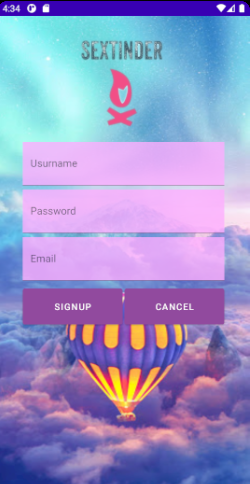
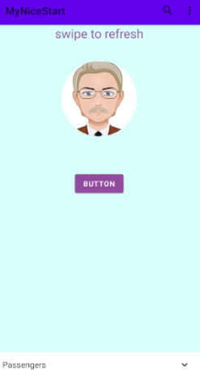

# MyNiceStart
Esta aplcacion es de "ligoteo" para verla:
[GitHub My Nice Start](https://github.com/Alvaro230/MyNiceStart)

Aqui abajo podeis ver las seis interfaces que tiene la aplicación:
En el main1 encontrareis(AppBar,Menú Contextual,Alert Dialog,SwipeRefreshLayout con SnackBar,Expandable Cardview) 
En el main2 encontrareis(Menú BottomBar (o BottomNavigation))
En el main3 encontrareis(DialogFlow)

SplashScreem | LogIn | SignUp
------ | ------ | ------
 |  | 
 Main1 | Main2 | Main3
  |  | 
  AppBar | Menú Contextual | SwipeRefreshLayout con SnackBar
   |  | 
   Expandable Cardview | Alert Dialog | BottomNavigation
    |  | 
